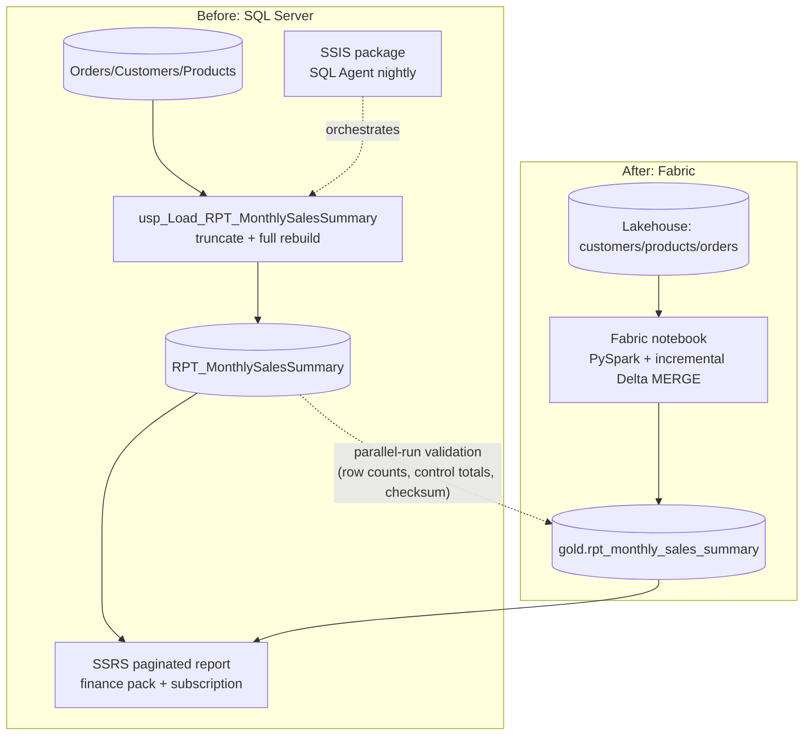

# Legacy-to-Fabric Migration

[](https://github.com/KushPatel29/legacy-to-fabric-migration/actions/workflows/ci.yml)


Modernizes a SQL Server stored-procedure ETL feeding an SSRS paginated
report into a Fabric notebook with incremental Delta MERGE loads —
including a runnable parallel-run validation step that proves the
refactored pipeline produces identical output before the legacy pipeline
is retired. CI executes the full parallel run on every push and fails the
build on a NO-GO verdict, plus negative tests that corrupt the output in
realistic ways and assert the validator catches every one.

Most portfolios show either "legacy SQL Server BI" or "modern Fabric" skills.
This project shows both, side by side, plus the part that's usually skipped
entirely: how you'd actually prove the migration is safe to cut over.

## Architecture



## Repo layout

```
data_generator/       synthetic Orders/Customers/Products generator
data/                 generated CSVs
legacy/sql/           legacy schema + the stored-procedure ETL being replaced
legacy/ssis/          SSIS package spec (build in SSDT — see the doc for why)
legacy/ssrs/          SSRS paginated report spec (build in Report Builder)
fabric/notebooks/     the Fabric/PySpark refactor
validation/           parallel-run validation: row counts, control totals, checksum
tests/                pytest suite incl. negative tests (corrupted-output detection)
docs/                 cutover runbook
.github/workflows/    CI — full parallel run + validation tests on every push
```

## How to reproduce

```bash
cd data_generator
pip install -r requirements.txt
python generate_source_data.py
```

Then either:
- **Full version**: load the CSVs into SQL Server (`legacy/sql/`), run the
  stored procedure, then build the Fabric side (`fabric/notebooks/`) against
  the same source data in a Lakehouse, and export both outputs for
  validation.
- **Quick local check** (no SQL Server/Fabric needed): run
  `python validation/build_local_reference_outputs.py` — two independent
  pandas implementations of the same business logic, standing in for the
  T-SQL and PySpark versions — then `python
  validation/parallel_run_validation.py` to see the full validation report.

## Parallel-run validation

`validation/parallel_run_validation.py` checks, in order: row counts,
dollar control totals, key-level diffs (rows only on one side), value
mismatches on matching keys, and a normalized row-level checksum — then
prints a GO/NO-GO verdict. See [`docs/cutover_runbook.md`](docs/cutover_runbook.md)
for how this fits into an actual cutover, including a real bug this
validation script hit during development (a dtype-formatting false
positive) and how it was fixed.

## Testing & CI

The validation framework itself is tested — including **negative tests**
that deliberately corrupt the fabric output (dropped row, shifted value,
offsetting errors that cancel in the control total, phantom extra key) and
assert the validator returns NO-GO for each. A validation framework you've
never seen fail is indistinguishable from one that doesn't work.

```bash
pip install pytest
pytest tests/ -v    # 6 tests: clean-run GO + 4 corruption classes caught + dtype regression
```

CI runs the entire parallel run from scratch on every push and fails the
build on a NO-GO verdict.

## Where this applies beyond SSIS/SSRS

The migration is Microsoft-stack, but the parallel-run validation pattern
is engine-agnostic — the validator diffs two CSVs and doesn't care what
produced them. The same framework de-risks any re-platforming where the
new system must reproduce the old system's numbers:

- Informatica / DataStage / Talend → any cloud data platform
- On-prem data warehouse → Snowflake / Databricks / BigQuery migrations
- Stored-procedure logic → dbt model conversions
- Excel/Access "shadow IT" reporting → governed BI replacement

## Notes on the synthetic data

All data is generated by `data_generator/generate_source_data.py` using
Faker and numpy. No real company data is used anywhere in this repo.
