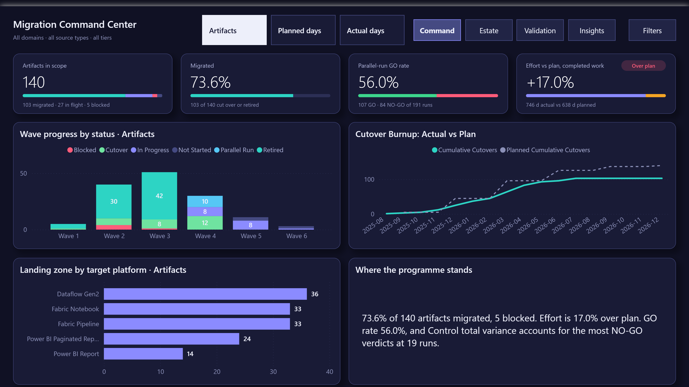
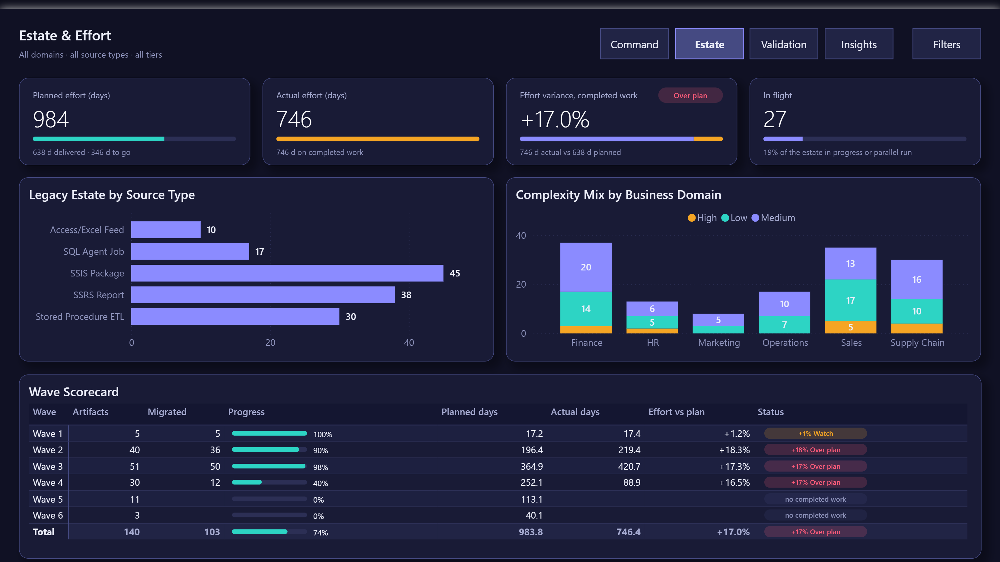
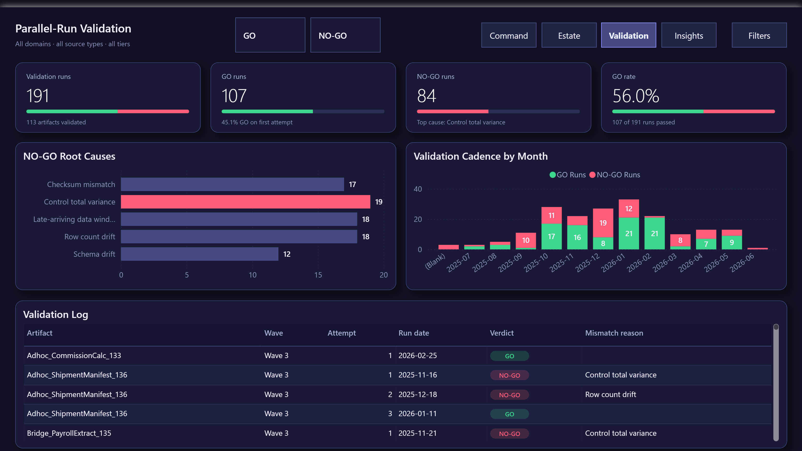
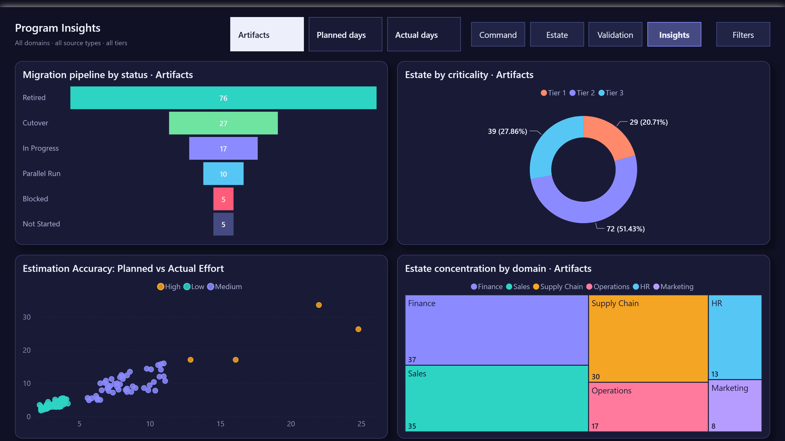
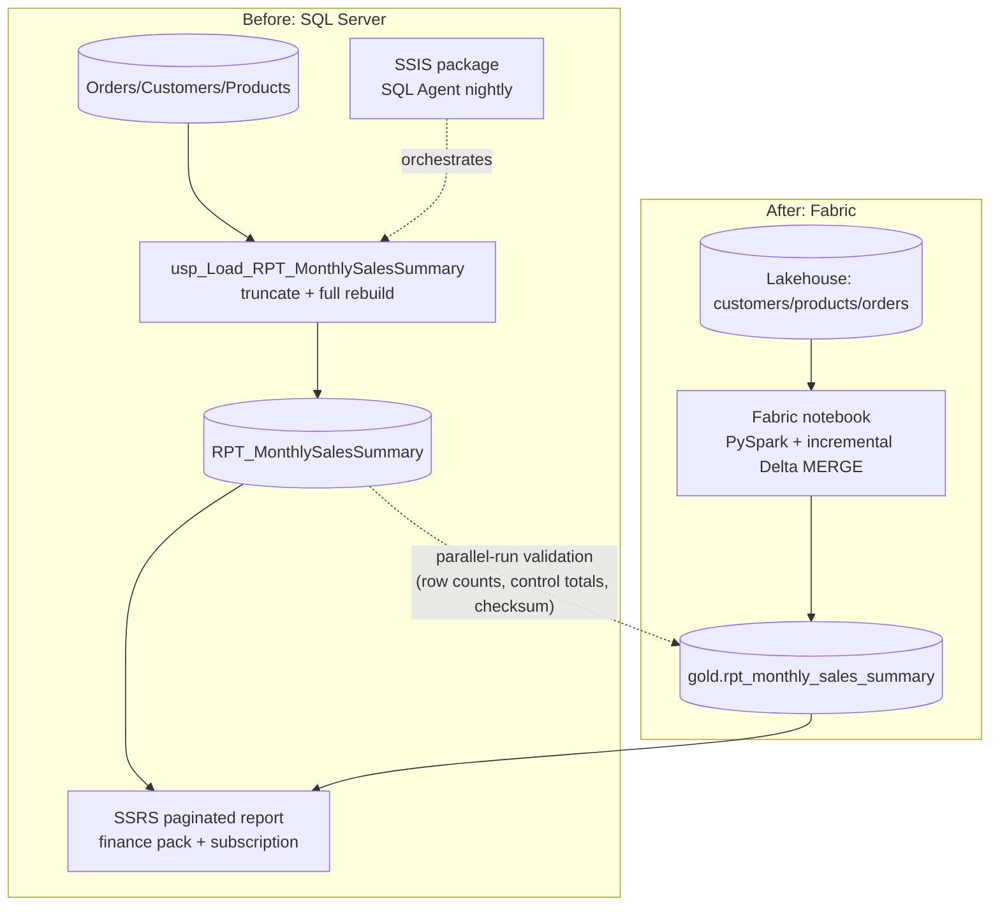

# Legacy-to-Fabric Migration

[](https://github.com/KushPatel29/legacy-to-fabric-migration/actions/workflows/ci.yml)


Modernizes a SQL Server stored-procedure ETL feeding an SSRS paginated
report into a Fabric notebook with incremental Delta MERGE loads —
including a runnable parallel-run validation step that proves the
refactored pipeline produces identical output before the legacy pipeline
is retired. CI executes the full parallel run on every push and fails the
build on a NO-GO verdict, plus negative tests that corrupt the output in
realistic ways and assert the validator catches every one.

Most portfolios show either "legacy SQL Server BI" or "modern Fabric" skills.
This project shows both, side by side, plus the part that's usually skipped
entirely: how you'd actually prove the migration is safe to cut over.

## Migration Command Center (Power BI)

The single-pipeline migration below is the *proof of technique*. This
dashboard scales that technique to a whole enterprise estate: a synthetic
140-artifact migration program (SSIS packages, SSRS reports, stored-procedure
ETL, SQL Agent jobs, Access/Excel feeds) tracked from discovery to retirement.
Hand-authored as a Power BI Project (TMDL semantic model + PBIR report) in
[`powerbi/pbip/`](powerbi/pbip/) — open `FabricMigrationCommandCenter.pbip`
and hit Refresh. The dataset is generated by
[`data_generator/generate_migration_program.py`](data_generator/generate_migration_program.py)
(fixed seed) and its invariants are enforced by CI on every push.

### How the dashboard mirrors a real migration program, step by step

| Step | What happens in a real program | Where it shows on the dashboard |
|---|---|---|
| 1. Inventory the estate | Crawl SSISDB, the SSRS catalog, `sys.procedures`, SQL Agent — every artifact gets an ID, owner, complexity, criticality | **Estate & Effort** — estate by source type, complexity mix by domain |
| 2. Plan waves | Strangler-fig sequencing: simple, low-risk artifacts first; Tier 1 / high-complexity last, so the team learns on cheap mistakes | **Command Center** — Wave Progress by Status; **Estate & Effort** — Wave Scorecard (planned vs actual effort) |
| 3. Refactor | Each artifact maps to a Fabric landing zone: notebooks, Dataflow Gen2, pipelines, Power BI reports | **Command Center** — Landing Zone chart |
| 4. Parallel-run | Legacy and Fabric run side by side; row counts, control totals, and checksums must agree (the runnable validator in `validation/` is exactly this check) | **Parallel-Run Validation** — validation cadence, NO-GO root causes |
| 5. GO/NO-GO cutover | An artifact cannot retire until its final parallel run is GO — same gate CI enforces on this repo | **Parallel-Run Validation** — GO Rate, Validation Log |
| 6. Retire & track | Burnup of cumulative cutovers against the program calendar; blocked items get a named blocker | **Command Center** — Cutover Burnup, Blocked Artifacts |

**Migration Command Center** — program health at a glance:



**Estate & Effort** — what the estate is made of and what it costs to move:



**Parallel-Run Validation** — the safety gate, scaled to the whole program:



**Program Insights** — advanced analytics: migration pipeline funnel,
estimation-accuracy scatter (planned vs actual effort by complexity), estate
treemaps:



## Architecture


```mermaid
flowchart TB
    subgraph Before["Before: SQL Server"]
        SRC1[(Orders/Customers/Products)]
        SP[usp_Load_RPT_MonthlySalesSummary<br/>truncate + full rebuild]
        RPT[(RPT_MonthlySalesSummary)]
        SSIS[SSIS package<br/>SQL Agent nightly]
        SSRS[SSRS paginated report<br/>finance pack + subscription]
        SRC1 --> SP --> RPT --> SSRS
        SSIS -.orchestrates.-> SP
    end

    subgraph After["After: Fabric"]
        SRC2[(Lakehouse: customers/products/orders)]
        NB[Fabric notebook<br/>PySpark + incremental Delta MERGE]
        GOLD[(gold.rpt_monthly_sales_summary)]
        SRC2 --> NB --> GOLD --> SSRS
    end

    RPT -. "parallel-run validation<br/>(row counts, control totals, checksum)" .-> GOLD
```

## Repo layout

```
data_generator/       synthetic Orders/Customers/Products generator
data/                 generated CSVs
legacy/sql/           legacy schema + the stored-procedure ETL being replaced
legacy/ssis/          SSIS package spec (build in SSDT — see the doc for why)
legacy/ssrs/          SSRS paginated report spec (build in Report Builder)
fabric/notebooks/     the Fabric/PySpark refactor
validation/           parallel-run validation: row counts, control totals, checksum
powerbi/              Migration Command Center PBIP (TMDL model + PBIR report)
data/migration/       generated program dataset: inventory, wave plan, run results
tests/                pytest suite: corruption detection + false-positive guards
docs/                 cutover runbook
.github/workflows/    CI — full parallel run + validation tests on every push
```

## How to reproduce

```bash
cd data_generator
pip install -r requirements.txt
python generate_source_data.py
```

Then either:
- **Full version**: load the CSVs into SQL Server (`legacy/sql/`), run the
  stored procedure, then build the Fabric side (`fabric/notebooks/`) against
  the same source data in a Lakehouse, and export both outputs for
  validation.
- **Quick local check** (no SQL Server/Fabric needed): run
  `python validation/build_local_reference_outputs.py` — two independent
  pandas implementations of the same business logic, standing in for the
  T-SQL and PySpark versions — then `python
  validation/parallel_run_validation.py` to see the full validation report.

## Parallel-run validation

`validation/parallel_run_validation.py` checks, in order: row counts,
dollar control totals, key-level diffs (rows only on one side), value
mismatches on matching keys, and a normalized row-level checksum — then
prints a GO/NO-GO verdict. See [`docs/cutover_runbook.md`](docs/cutover_runbook.md)
for how this fits into an actual cutover, including a real bug this
validation script hit during development (a dtype-formatting false
positive) and how it was fixed.

## The bug the tests caught

**Two empty outputs used to return GO.**

If the source connection breaks, or a filter excludes everything, or an
upstream load fails silently, both pipelines emit nothing. Row counts match
at zero. Control totals match at zero. The checksums are identical. Every
check passes, and the gate cheerfully reports that it is safe to retire the
legacy pipeline — for a report that would go to zero rows the next morning.

Nothing crashed. No existing test failed. The validator was simply never
asked what it thought about a parallel run that never ran. It now carries an
explicit `non_empty` check, and
[`test_two_empty_outputs_are_not_a_go`](tests/test_validator_edge_cases.py)
is the first test in the file.

This is the whole argument for testing a validation framework against cases
you invent rather than against the absence of complaints.

## Testing & CI

A cutover gate has two jobs, and most test suites only cover one.

**It must fire on real differences.** Negative tests deliberately corrupt the
fabric output — dropped row, shifted value, offsetting errors that cancel in
the control total, phantom extra key, duplicate key, quantity drift that
leaves revenue tying, a renamed region that orphans a row in both directions —
and assert NO-GO for each.

**It must not fire on differences that are not differences.** Spark makes no
ordering promise, so the same data comes back shuffled every run; float
arithmetic differs in the last place between engines; the same value
round-trips as `int64` in one and `float64` in the other. A gate that fires on
any of those gets switched off in week one. Each is a test.

Writing those is also how I learned the gate is **cent-exact**, not merely
within-a-cent: a $0.009 drift is under the stated tolerance but rounds to a
different cent, so the checksum vetoes it. That is correct for money and I
left it — a gate that shrugs at one cent on one row will shrug at it on a
million — but it is now written down instead of being a surprise.

```bash
pip install pytest
pytest tests/ -v    # 95 tests: the clean GO, 8 corruption classes, 4 false-positive
                    # guards, the empty-run gate, a conjunctive-verdict check per
                    # rule, 5 migration-program invariants, the semantic-model
                    # bindings (a column the model binds but never types arrives as
                    # text, sorts alphabetically, and breaks any measure using it),
                    # a check that no measure ignores a slicer on its own page,
                    # and the badge above against what pytest collects
```

CI runs the entire parallel run from scratch on every push and fails the
build on a NO-GO verdict.

## Where this applies beyond SSIS/SSRS

The migration is Microsoft-stack, but the parallel-run validation pattern
is engine-agnostic — the validator diffs two CSVs and doesn't care what
produced them. The same framework de-risks any re-platforming where the
new system must reproduce the old system's numbers:

- Informatica / DataStage / Talend → any cloud data platform
- On-prem data warehouse → Snowflake / Databricks / BigQuery migrations
- Stored-procedure logic → dbt model conversions
- Excel/Access "shadow IT" reporting → governed BI replacement

## Notes on the synthetic data

All data is generated by `data_generator/generate_source_data.py` using
Faker and numpy. No real company data is used anywhere in this repo.
