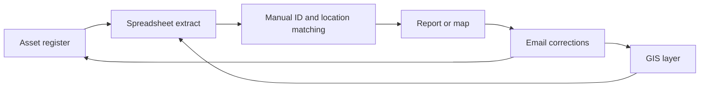
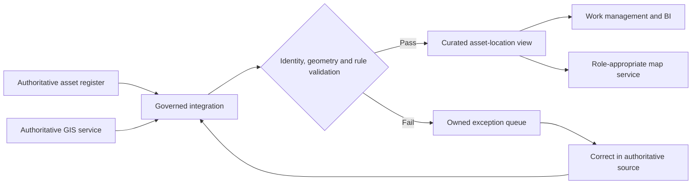

# GIS Integration Requirements

## Evidence Boundary

This is a portfolio extension to the migration programme. It demonstrates how
I would analyse an enterprise GIS integration; it is not a claim of municipal
employment, production GIS administration, Esri configuration, or access to a
City asset system.

## Purpose

Define the business and control requirements for synchronising an authoritative
asset or facility register with a GIS layer and making spatial context available
to work management, reporting, and field decision-making.

## Scope

In scope:

- business-key matching between the asset register and GIS features;
- agreed ownership for attributes, geometry, condition, and work status;
- scheduled and exception-based synchronisation;
- map-based search, filtering, and drill-through to the asset record;
- validation, error handling, audit history, security, and acceptance.

Out of scope:

- selecting or procuring a GIS platform;
- editing production geometry or publishing public-facing maps;
- defining local asset-management policy without asset-owner workshops;
- assuming a coordinate reference system before reviewing source layers.

## Stakeholders

| Stakeholder | Primary concern | Decision or contribution |
|---|---|---|
| Asset or service owner | Service consequence and lifecycle decisions | Defines criticality, status, and acceptable use |
| GIS administrator | Geometry quality, services, CRS, publishing | Confirms authoritative layers and edit workflow |
| Work-management owner | Work orders, inspections, field status | Owns operational state and integration timing |
| Field users | Usability, offline needs, location accuracy | Validate real-world search and update scenarios |
| Finance | Asset value, project and cost-centre alignment | Confirms financial keys and reconciliation |
| IT, security, and privacy | Identity, interfaces, retention, exposure | Approve access and integration controls |
| Records and information management | Retention and official-record rules | Defines audit and disposition requirements |
| BI support | Semantic model, data quality, monitoring | Implements reporting joins and exception visibility |

## Current State

Risks include unmatched identifiers, conflicting owners, stale extracts,
unrecorded geometry changes, coordinate-system assumptions, duplicate edits,
and no common audit trail from source correction to published decision.

## Future State

## Requirements Register

| ID | Requirement | Priority | Acceptance condition |
|---|---|---:|---|
| GIS-BR-01 | Each GIS feature and asset record uses a stable, documented business key. | Must | The reconciliation reports matched, unmatched, duplicate, and retired keys separately. |
| GIS-BR-02 | Attribute and geometry ownership is explicit by field. | Must | The data dictionary names an authoritative system and owner for every published attribute. |
| GIS-BR-03 | CRS and transformation rules are recorded for every spatial source. | Must | Source CRS, target CRS, transformation, accuracy expectation, and validation method are approved before load. |
| GIS-BR-04 | A failed match or invalid geometry cannot silently publish as current. | Must | The record is quarantined with reason, owner, timestamp, and source link. |
| GIS-BR-05 | Users can move between map, asset, work-order, and reporting context without re-keying an identifier. | Should | UAT completes bidirectional drill-through for agreed user roles. |
| GIS-BR-06 | Synchronisation direction and frequency reflect business ownership. | Must | Each interface documents source, target, schedule/event, latency target, and conflict rule. |
| GIS-BR-07 | Spatial and asset changes remain auditable. | Must | A reviewer can identify old value, new value, editor or source process, time, and approval where required. |
| GIS-BR-08 | Map access follows least privilege and privacy rules. | Must | Role tests confirm restricted layers and sensitive attributes are unavailable to unauthorised users. |
| GIS-BR-09 | Reporting distinguishes current, planned, retired, and out-of-service assets. | Must | Status definitions reconcile between GIS, work management, finance, and the semantic model. |
| GIS-BR-10 | Field workflows define offline, accuracy, and failed-sync behaviour before release. | Should | UAT covers offline capture, reconnect, conflict, and visible sync status. |

## Minimum Data Mapping

| Business concept | Example fields | Authoritative owner | Key control |
|---|---|---|---|
| Asset identity | asset ID, asset class, status | Asset register | Unique, persistent, never reused |
| Spatial identity | feature ID, layer, geometry type | GIS | One approved feature relationship per rule |
| Location | geometry, address, road segment, facility | GIS or named service owner | CRS and accuracy recorded |
| Work context | work-order ID, inspection, priority, status | Work management | Valid asset key and lifecycle state |
| Financial context | cost centre, project, acquisition value | Finance | Reconciles to approved financial hierarchy |
| Audit | source, changed at/by, approval, load ID | Source system / integration | Immutable history for controlled fields |

## UAT Scenarios

1. Find an in-service asset on the map and open its current asset and work-order
   record without manually copying an ID.
2. Reject a duplicate asset key and route it to the correct owner.
3. Quarantine invalid geometry and retain the last approved published state with
   a visible timestamp.
4. Transform a controlled sample between the agreed source and target CRS and
   verify the expected positional tolerance.
5. Retire an asset and confirm the map, operational report, and financial view
   reflect the agreed lifecycle rule.
6. Attempt restricted-layer access using each defined role.
7. Capture a field update offline, reconnect, and exercise the conflict rule.
8. Reconcile record counts and key exceptions across asset, GIS, work, and BI
   views after synchronisation.

## Decisions Needed Before Design Approval

- Which system owns asset identity, lifecycle status, geometry, and address?
- Is the relationship one asset to one feature, one to many, or class-specific?
- Which local CRS and transformation standards apply?
- What positional accuracy is fit for each operational use?
- Which interfaces are read-only, bidirectional, scheduled, or event-driven?
- Which layers or attributes have privacy, security, or public-release limits?
- What is the acceptable stale-data window during an outage?
- Who owns unmatched records and who accepts residual risk at release?

## Success Measures

- unmatched and duplicate-key rate;
- geometry-validation failure rate;
- time to resolve GIS/asset exceptions;
- percentage of operational records within the agreed freshness target;
- user task completion without spreadsheet re-keying;
- reconciliation coverage across GIS, asset, work, finance, and BI systems.
