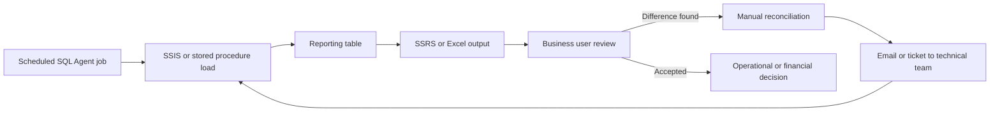
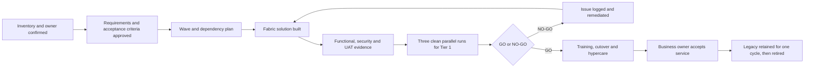

# Process Analysis and Requirements Traceability

## Current State

### Current-State Problems

- Ownership and downstream consumers are not held in one approved inventory.
- Acceptance criteria are often implicit in a report's historical behaviour.
- Manual reconciliation happens after delivery rather than before publication.
- A technical deployment and a business-process change can be approved through
  different channels.
- Support teams may learn of a changed dependency only after an incident.
- Legacy retirement is difficult to audit when approval is stored in email.

## Future State

## Requirements Register

| ID | Requirement | Priority | Acceptance evidence | Owner |
|---|---|---|---|---|
| BR-01 | Every migration artifact must have a business owner, purpose, criticality, and consumer list. | Must | Inventory completeness report equals 100%. | Business owner |
| BR-02 | Month-end and statutory outputs must remain available throughout transition. | Must | Approved blackout calendar and no unplanned outage during test cutover. | Finance owner |
| BR-03 | Users must receive the same approved metric definitions unless a separate change is authorised. | Must | Metric owner signs the comparison and any approved exception. | Metric owner |
| FR-01 | The programme must record artifact status, wave, blocker, owner, planned effort, and actual effort. | Must | Command Center fields populated and report filters reconcile to source. | Programme manager |
| FR-02 | The solution must compare legacy and Fabric row counts, control totals, keys, values, and checksums. | Must | Validator returns GO only when every required check passes. | Technical lead |
| FR-03 | A NO-GO result must block retirement and identify the failing check. | Must | Injected-failure tests return NO-GO with a named reason. | Technical lead |
| FR-04 | Users must be able to trace a published result to its validation run and approval decision. | Should | Result, run ID, and decision record are linked. | Business analyst |
| NFR-01 | Access must follow least privilege and preserve separation of duties. | Must | Security review and role test pass. | Security lead |
| NFR-02 | Cutover must be reversible within the agreed recovery window. | Must | Rollback rehearsal completes within the target window. | Technical lead |
| NFR-03 | The migration register and decision trail must be searchable, versioned, and retained. | Must | Records-management review passes. | Programme manager |
| CHG-01 | Each affected user group must receive role-specific communication before its wave. | Must | Communication register shows delivery to 100% of groups. | Change lead |
| CHG-02 | Required users and service-desk analysts must complete preparation before GO. | Must | At least 90% completion and no unsupported critical role. | Business owner |

## Traceability to Implemented Evidence

| Requirement | Repository evidence |
|---|---|
| FR-01 | Generated programme inventory and Power BI Migration Command Center |
| FR-02 | `validation/parallel_run_validation.py` |
| FR-03 | Negative tests under `tests/` and the conjunctive GO or NO-GO verdict |
| NFR-02 | Existing [cutover runbook](../cutover_runbook.md) with disable-not-delete rollback |
| BR-03 | Row, value, and checksum comparisons preserve approved output behaviour |
| BR-01, FR-04, NFR-03 | Designed controls in this delivery pack; not implemented as a production records system |
| CHG-01, CHG-02 | Targets in the [change and adoption plan](CHANGE_AND_ADOPTION_PLAN.md); not claimed as achieved |

## UAT Entry Criteria

- Requirements baseline approved and traceable to test cases.
- Test environment and representative, non-sensitive test data available.
- Functional and security defects rated critical or major are closed.
- Expected results and data owners are named.
- Rollback path has been reviewed.

## UAT Exit Criteria

- All critical business scenarios executed.
- No open critical or major defects.
- Business owner approves results or records a time-limited exception.
- Support documentation and known issues are ready.
- GO or NO-GO decision references the executed evidence.
