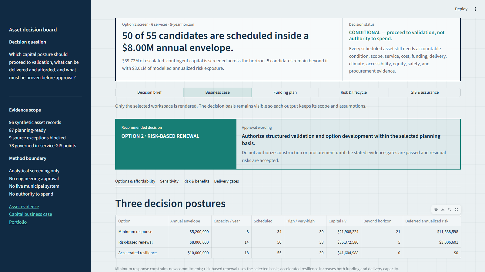
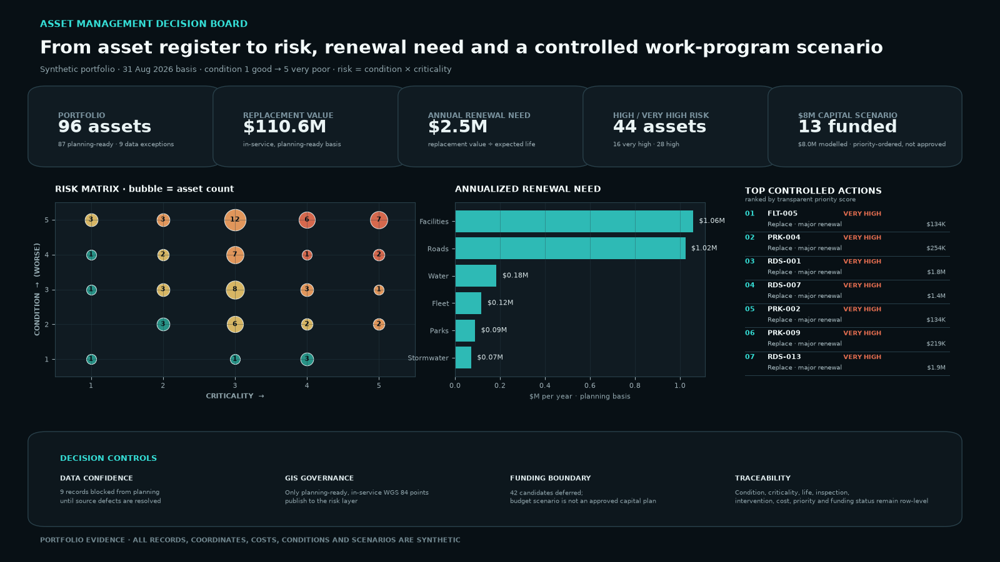
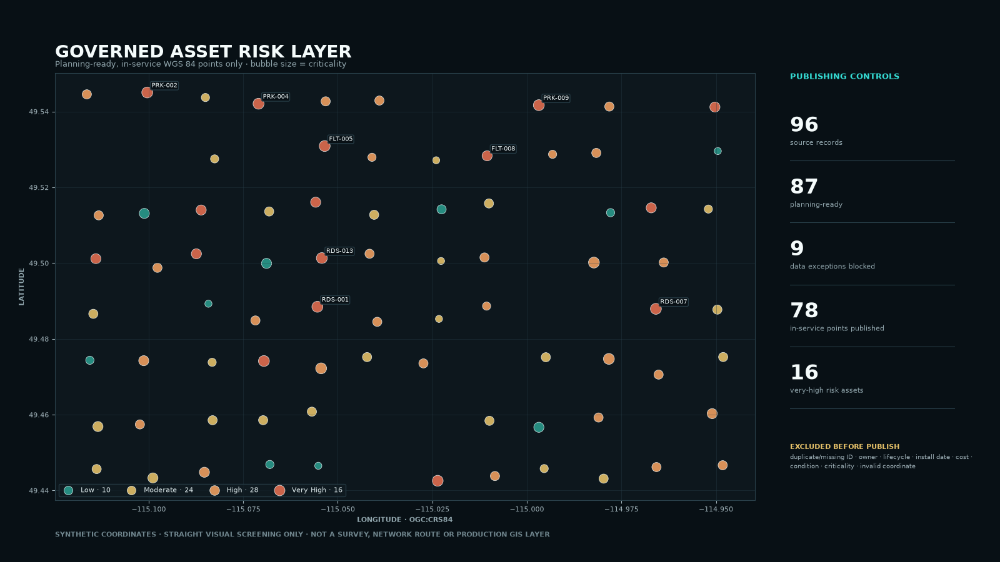

# Asset Management Decision Evidence

This implemented portfolio case turns a deterministic, synthetic 96-record
asset register into a lifecycle assessment, risk layer, annualized renewal-need
view, prioritised work programme, and constrained capital business case.

**[Launch the live decision board](https://kush-asset-management-decision-board.streamlit.app/)**
to compare three investment postures; challenge the annual envelope, horizon,
delivery capacity, escalation, contingency, discount rate, service/risk scope,
and indicative grant/reserve/debt mix; inspect the asset-level decision sheet;
review technical and customer service outcomes; compare four lifecycle
strategies per service; inspect the controlled decision record; review
sensitivities, programme risks, benefits, delivery gates, and GIS/data
assurance; and export the exact investment-committee evidence pack.

The supporting
[`asset capital programme business case`](../../docs/business-analysis/ASSET_CAPITAL_PROGRAM_BUSINESS_CASE.md)
sets out the strategic, economic, commercial, financial, and management case,
including stakeholders, approval conditions, decision triggers, records, and
the evidence still required before authority to spend.



It is built to show the business-analysis work around asset information—not
just a map. Every record keeps its service owner, lifecycle, age, expected life,
replacement value, condition, criticality, inspection evidence, risk,
intervention, priority, and scenario funding status visible.





## Evidence Boundary

All asset names, coordinates, dates, costs, conditions, risks, priorities, and
funding scenarios are synthetic. The model demonstrates a transferable asset-
management analysis pattern; it is not a condition assessment, an approved
capital plan, an optimisation model, or evidence of municipal employment.

## Decision Flow

```text
96-record cross-service asset register
        │
        ├── identity · ownership · lifecycle · cost · condition · criticality · WGS 84 controls
        │       └── failed material records → DATA_REMEDIATION (not scored or funded)
        │
        └── planning-ready, in-service assets
                ├── condition × criticality risk band
                ├── inspection recency and life consumed
                ├── annualized renewal need and risk exposure
                ├── explainable intervention and priority score
                ├── three funding and delivery postures
                ├── annual cash + delivery-capacity constrained ten-year plan
                ├── technical + customer service-level gaps
                ├── four lifecycle strategies per service
                ├── one controlled decision record per candidate
                ├── cost/funding sensitivities + owned risks and benefits
                ├── stage-gated delivery and approval conditions
                └── governed GeoJSON risk layer + committee-pack export
```

The source deliberately contains missing and invalid values, a duplicated
asset ID, and an invalid coordinate. Material data exceptions are routed to a
visible remediation status rather than silently imputed into the capital
scenario. A missing inspection does not invent a condition; it raises an
inspection action and recency penalty.

## Methods

| Measure | Transparent rule |
|---|---|
| Condition | 1 good to 5 very poor |
| Criticality | 1 low to 5 very high |
| Risk score | condition × criticality, from 1 to 25 |
| Risk bands | Low 1–4; Moderate 5–9; High 10–15; Very High 16–25 |
| Annualized renewal need | replacement cost ÷ expected life for in-service, planning-ready assets |
| Annualized risk exposure | replacement cost × condition probability × criticality consequence factor |
| Priority score | risk × 4 + capped life consumed × 0.18 + inspection-recency penalty |
| Capital scenario | take planning-ready capital candidates in priority order while the next treatment fits within $8M |
| Multi-year programme | preserve priority order while each year enforces the selected cash ceiling and delivery-capacity limit |
| Screened project cost | source treatment screen × planning contingency × scheduled-year escalation |
| Capital present value | screened project cost discounted to the planning decision date; capital costs only |

The affordability scenario is intentionally simple and inspectable. It is not
presented as an optimised capital programme or a whole-life economic appraisal:
real prioritisation requires engineering assessments, service levels,
statutory obligations, safety, accessibility, equity, climate resilience,
environmental review, project bundling, delivery capacity, funding
restrictions, operating impacts, residual value, benefits, and consultation
with accountable owners.

## Outputs

- [`asset_register.csv`](asset_register.csv) — generated source with deliberate
  data-quality failures;
- [`asset_portfolio_assessment.csv`](output/asset_portfolio_assessment.csv) —
  one traceable assessment row per source record;
- [`prioritized_work_program.csv`](output/prioritized_work_program.csv) —
  reviewable non-monitor actions ordered by the published score;
- [`asset_management_summary.json`](output/asset_management_summary.json) —
  portfolio, risk, renewal, and capital-scenario control totals; and
- [`asset_risk_layer.geojson`](output/asset_risk_layer.geojson) — governed WGS
  84 points for planning-ready, in-service assets only.

The downloadable app evidence pack additionally contains the service-level
catalogue and asset-pressure position, lifecycle-strategy catalogue, and one
controlled decision record for every screened capital candidate. Those records
preserve the analytical basis and required approval conditions; none is an
approval or authority to spend.

Rebuild them with:

```bash
python examples/asset_management/build_asset_management_case.py
```

The tests prove the fixed portfolio shape, deliberate exception routes,
condition-criticality logic, intervention rules, control-total reconciliation,
budget ceiling, priority ordering, exclusion of invalid records from funding,
GeoJSON validity, committed outputs, multi-year annual cash and delivery limits,
option comparison, sensitivity cases, funding reconciliation, owned risk and
benefit registers, service-level targets and direction, four lifecycle
strategies per service, decision-record controls, evidence-pack completeness,
live workspaces, and both visuals' 1600×900 review size.

## Business Questions Before Production Use

- What service levels and consequences define criticality for each asset class?
- Who owns identity, condition, geometry, lifecycle, replacement value, and
  work status—and where may each be corrected?
- Which inspection method and evidence justify each condition grade?
- Which local design standards, levels of service, climate assumptions, safety
  obligations, and accessibility requirements change the intervention?
- How should project bundling, grants, debt, reserves, procurement capacity,
  and delivery windows constrain the multi-year capital plan?
- Which risk, service, equity, and affordability measures must appear in staff,
  leadership, and Council briefings?
- What decision requires professional engineering judgment rather than an
  analytical screening model?
